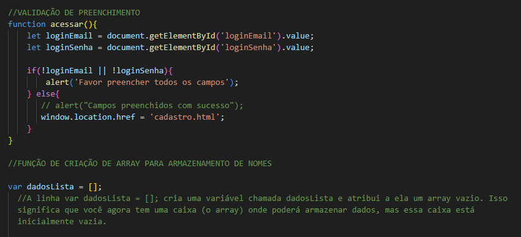
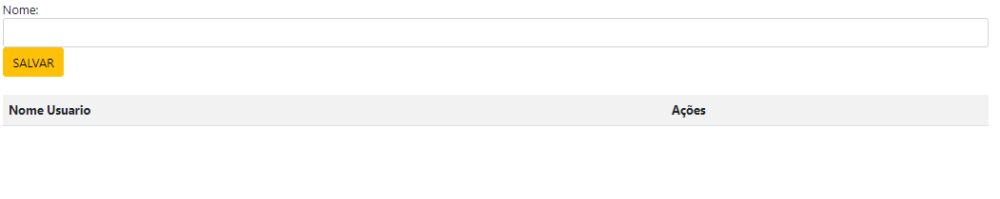

# login-cad
 

# Explicação do Código controller.js
Este código JavaScript implementa funcionalidades de validação de formulário, gerenciamento de uma lista de usuários, e manipulação de dados dentro de uma tabela HTML. A seguir, descreveremos cada uma das funções e partes do código em detalhes.

# 1. Função acessar()  

Objetivo: Garantir que os campos de login (e-mail e senha) estejam preenchidos antes de permitir que o usuário prossiga para outra página.
Funcionamento:
A função começa obtendo os valores dos campos de e-mail e senha utilizando o método getElementById para acessar os elementos HTML com os IDs loginEmail e loginSenha.
Estes valores são armazenados nas variáveis loginEmail e loginSenha.
A seguir, a função verifica se algum desses valores é vazio (falsy). Se um dos campos não estiver preenchido, a função exibe um alerta (alert) solicitando ao usuário que preencha todos os campos.
Se ambos os campos estiverem preenchidos, a função redireciona o usuário para a página cadastro.html utilizando window.location.href.

# 2. Função salvarUser()  

Objetivo: Adicionar um nome à lista de usuários (armazenada em um array) e atualizar a tabela que exibe essa lista.
Funcionamento:
A função começa obtendo o valor do campo de texto onde o nome do usuário é inserido (nomeUser).
Se o campo nomeUser não estiver vazio, o nome é adicionado ao array dadosLista usando o método push.
Em seguida, a função crialista() é chamada para atualizar a tabela HTML que exibe a lista de usuários.
O campo de texto é então limpo para preparar para a próxima entrada.
Se o campo nomeUser estiver vazio, a função exibe um alerta solicitando que um nome seja informado.  

# Por que usar um array nessa situação?
1 Armazenamento: O array dadosLista serve como um depósito para os nomes dos usuários. Cada vez que um novo nome é inserido, ele é adicionado ao final do array.    

2 Organização: Ao utilizar um array, você mantém os nomes dos usuários em uma estrutura organizada. Isso facilita a manipulação e exibição dos dados posteriormente.

3 Reutilização: Os dados armazenados no array podem ser reutilizados de diversas formas. Por exemplo, você pode:  

◦ Exibir todos os nomes em uma lista.
◦ Buscar por um nome específico.
◦ Realizar cálculos ou outras operações com os dados.

4 Persistência: Embora o array no exemplo seja armazenado na memória do navegador, você pode estender essa funcionalidade para salvar os dados em um arquivo local ou em um servidor, garantindo a persistência dos dados mesmo após a página ser recarregada.

# 3. Função crialista()  

Objetivo: Exibir a lista de usuários na tabela HTML.
Funcionamento:
A função começa definindo o cabeçalho da tabela (títulos das colunas) como "Nome Usuário" e "Ações".
A função então usa um loop for para iterar sobre todos os elementos do array dadosLista, começando do índice 0 até o último índice (dadosLista.length - 1).
Para cada nome no array, a função cria uma nova linha na tabela, contendo o nome do usuário e dois botões: "Editar" e "Excluir". Esses botões chamam as funções editar() e excluir() respectivamente, passando o índice da linha na tabela como argumento.
Finalmente, a tabela HTML é atualizada com o conteúdo gerado.

# 4. Função excluir(i)  

Objetivo: Remover um nome da lista de usuários e atualizar a tabela HTML.
Funcionamento:
A função recebe o índice i da linha da tabela onde o botão "Excluir" foi clicado.
Em seguida, o nome correspondente no array dadosLista é removido usando o método splice, que remove o item no índice especificado.
A função então remove a linha correspondente da tabela HTML usando deleteRow.

# 5. Função editar(i)  

Objetivo: Permitir a edição de um nome na lista de usuários.
Funcionamento:
A função recebe o índice i da linha da tabela onde o botão "Editar" foi clicado.
O valor correspondente no array dadosLista é carregado no campo de texto nomeUser para edição.
O nome antigo é removido da lista usando splice, deixando o campo pronto para uma nova entrada ou edição.
tem menu de contexto

# Quando e Como Usar Arrays
• JavaScript: Arrays em JavaScript são extremamente úteis para:  
◦ Armazenar listas de itens (números, strings, objetos, etc.).  
◦ Alterar sobre esses itens usando loops.  
◦ Manipular dados de forma eficiente.  
• Outras Linguagens: Em linguagens server-side, arrays são usados para:  
◦ Armazenar dados provenientes de bancos de dados ou outras fontes.  
◦ Gerar HTML dinamicamente, como listas, tabelas ou outros elementos que se repetem.

# A seguir o resultado:  

Agora iremos ver o resultado com nome salvo:  
 

# Campo De Email

&lt;label for=""&gt; Email:&lt;label&gt;:  
• O elemento <label> é usado para associar um rótulo a um campo de entrada (input) em um formulário.  
• O atributo for="" geralmente é usado para especificar o id do campo de entrada que o rótulo está   descrevendo. No entanto, neste caso, o atributo for está vazio, o que significa que não está explicitamente associado a nenhum campo de entrada.  
• O texto "Email:" é o rótulo que será exibido ao lado do campo de entrada.  
&lg;input type="text" class="form-control" id="nomeUser"&gt;:  
• O elemento &lt;input&gt; cria um campo de entrada de texto.  
• O atributo type="text" especifica que o campo é do tipo texto.  
• class="form-control" atribui a classe CSS form-control ao campo, que geralmente é usada em frameworks como Bootstrap para estilizar campos de formulário.  
• id="nomeUser" define um identificador único para o campo de entrada. Este id pode ser usado para associar o rótulo ao campo ou para aplicar estilos ou scripts ao campo.  
&lt;button type="button" class="btn btn-warning"&gt;SALVAR&gt;button&gt;:  
• O elemento &lt;button&gt; cria um botão no formulário.  
• type="button" indica que este botão não envia o formulário quando clicado. Ele pode ser usado para outras ações, como executar um script JavaScript.  
• class="btn btn-warning" atribui classes CSS ao botão, que geralmente são usadas em frameworks como Bootstrap para estilizar o botão (neste caso, como um botão de aviso ou atenção).  
• O texto "SALVAR" será exibido no botão, indicando ao usuário que este botão serve para salvar alguma informação.  

## validação de email: 

## Explicação Detalhada: 

1- definição da função:  

Esta linha define uma nova função chamada salvarUser. O código dentro das chaves {} será executado quando a função for chamada.  

2- Obtenção dos Valores dos Campos:  

Estas linhas obtêm os valores dos campos de entrada no formulário. document.getElementById('nomeUser') seleciona o elemento com o ID nomeUser, e .value obtém o valor inserido pelo usuário nesse campo. O mesmo se aplica ao campo emailUser.  

3-Validação do E-mail:  

Este bloco de código verifica se o e-mail é válido:

document.getElementById('emailUser').value == "" verifica se o campo de e-mail está vazio.  
document.getElementById('emailUser').value.indexOf('@') == -1 verifica se o caractere @ está presente no e-mail.     
document.getElementById('emailUser').value.indexOf('.') == -1 verifica se o caractere . está presente no e-mail.   
Se qualquer uma dessas condições for verdadeira, isso indica que o e-mail é inválido.  

4- Exibição da Mensagem de Alerta e Retorno:  

alert("Por favor, informar um E-mail válido"); exibe uma mensagem de alerta para o usuário.
return false; encerra a execução da função e indica que a validação falhou. Em contextos de formulários, isso pode impedir que o formulário seja enviado.  

##  Observações
Validação do E-mail: A validação implementada é bastante simples e pode não cobrir todos os casos de e-mails válidos, mas é suficiente para um exemplo básico.  
Uso do return false: Em muitos casos, você usaria return false para evitar o envio do formulário, mas isso pode precisar de ajustes dependendo do contexto onde a função salvarUser é utilizada.    

## Explicação para armazenar o Email:

dadosLista.splice((i - 1), 1);:  

dadosLista é um array que provavelmente contém uma lista de dados (talvez registros ou itens de uma tabela).  
O método splice é usado para modificar o array. O primeiro argumento (i - 1) é o índice onde a modificação começa, e o segundo argumento 1 indica que queremos remover 1 item a partir desse índice.  
Subtraímos 1 de i porque os índices dos arrays em JavaScript são baseados em zero (ou seja, começam em 0), enquanto i parece ser baseado em 1 (talvez a contagem de linhas ou itens na interface do usuário).
salvaEmail.splice((i - 1), 1);:  

salvaEmail parece ser um array que armazena e-mails (ou talvez dados relacionados a e-mails).  
Da mesma forma que com dadosLista, estamos removendo 1 item a partir do índice (i - 1) no array salvaEmail.  
document.getElementById('tabela').deleteRow(i);:  
 
Aqui, estamos interagindo com a DOM (Document Object Model) da página web.  
document.getElementById('tabela') seleciona um elemento HTML com o id "tabela", que provavelmente é uma tabela.  
O método deleteRow(i) remove a linha com o índice i da tabela. Mais uma vez, i    

